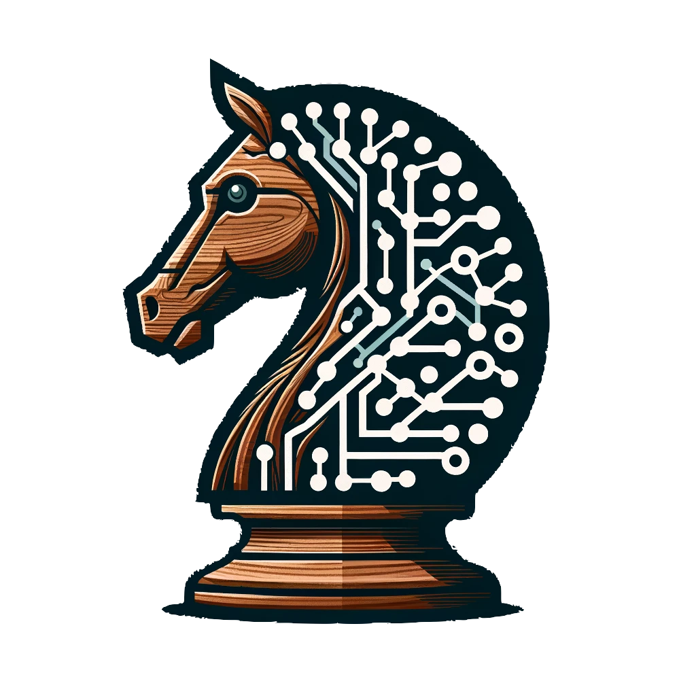

<!-- PROJECT LOGO -->
<br />
<div align="center">
  <a href="https://github.com/dechantoine/explainable-chess-engine">
    
  </a>

  <h3 align="center">Explainable Chess Engine</h3>

  <p align="center">
    A minimalist DL chess engine with explainability.
    <br />
    <br />
    <a href="https://huggingface.co/spaces/dechantoine/explainable-chess-engine">View Demo</a>
    ·
    <a href="https://github.com/dechantoine/explainable-chess-engine">Report Bug</a>
    ·
    <a href="https://github.com/dechantoine/explainable-chess-engine">Request Feature</a>
  </p>
</div>

<!-- TABLE OF CONTENTS -->
<details>
  <summary>Table of Contents</summary>
  <ol>
    <li>
      <a href="#about-the-project">About The Project</a>
      <ul>
        <li><a href="#objectives">Objectives</a></li>
        <li><a href="#roadmap">Roadmap</a></li>
      </ul>
    </li>
    <li>
      <a href="#getting-started">Getting Started</a>
      <ul>
        <li><a href="#prerequisites">Prerequisites</a></li>
        <li><a href="#installation">Installation</a></li>
      </ul>
    </li>
    <li><a href="#usage">Usage</a></li>
    <li><a href="#license">License</a></li>
    <li><a href="#contact">Contact</a></li>
  </ol>
</details>

<!-- ABOUT -->

## About The Project

This project aim to build a minimalist Deep Learning chess engine with explainability.
The goal is to create a chess engine that can explain its decisions in a human-readable way.
This project will be a great way to learn about chess engines, deep learning, and explainability in AI.

### Objectives

- Build a Deep Learning framework optimized for training with chess data.
- Monitor the performance of the training framework to optimize training time, CPU/GPU usage, and memory usage.
- Demonstrate proficiency in PyTorch, Tensorflow, Keras and Jax.
- Build the best model with the minimal number of parameters for several ELO levels.
- Create a human-readable explanation of the model's decisions.
- Implement a chess engine that can play against human or AI players using the model.

### Roadmap

- [x] Create the project structure
- [x] Pytorch Framework
  - [x] Custom pytorch dataset for chess data
    - [x] Read any board state at any game number in a PGN file
    - [x] Convert board, moves and game result to tensor
    - [x] Batch all operations
    - [x] Tests
  - [x] Training loop & utilities for training
    - [x] Training loop
    - [x] Logging & Tensorboard
    - [x] Evaluation
    - [x] Save & Load model
    - [x] Tests for training framework
- [ ] Tensorflow Framework
  - [ ] Custom TFRecords for chess data
    - [ ] Read any board state at any game number in a PGN file
    - [ ] Convert board, moves and game result to tensor
    - [ ] Batch all operations
    - [ ] Tests
- [x] Chess Engine
  - [x] Beam Search using the DL models
  - [x] Implement matches
  - [x] Evaluate against Stockfish
  - [x] Tests for the chess engine
- [ ] Explainability
  - [x] Beam Search visualization
  - [ ] Board evaluation visualization
- [ ] Deployment
  - [ ] Dockerize the project
  - [ ] Deploy on Lichess
  - [x] Deploy on HuggingFace

<!-- GETTING STARTED -->

## Getting Started

### Prerequisites

You need to have Python 3.11 installed on your machine.

### Installation

1. Clone the repo
   ```sh
   git clone https://github.com/dechantoine/explainable-chess-engine.git
   ```
2. Install the project dependencies using Poetry.
   ```sh
   poetry install
   ```

## Test package

### Run unit tests

```sh
poetry run python -m pytest
```

### Run performance tests

```sh
poetry run python -m profiling.profile dataset --n_test=10 --data_dir=data --save_dir=profile
```

```sh
poetry run python -m profiling.profile parquet-dataset --n_test=10 --save_dir=profile_package/profile_parquet_dataset --max_workers=8
```

### Visualize performance tests

```sh
poetry run snakeviz profile_package/profile_parquet_dataset/getitems.prof
```

## Usage

### Convert a directory of PGN files to a parquet dataset

```sh
poetry run python -m scripts.write_to_parquet process-directory --input_path=sample_data --output_path=parquet_data
```

### Train a model using the RL framework

```sh
poetry run python -m src.train.train rl --run_name=run_name --dataset_num_workers=8 --dataloaders_num_workers=2 --train_size=0.9 --n_epochs=20 --batch_size=64 --lr=0.1 --gamma=0.99 --log_sampling=0.05 --eval_sampling=1.0 --checkpoint_dir=checkpoints --log_dir=logdir
```

### Train a model using the supervised framework

```sh
poetry run python -m src.train.train distill --run_name=run-name --lr=0.01 --dataloaders_num_workers=4 --log_sampling=0.01 --eval_sampling=1.0 --checkpoint_dir=checkpoints --log_dir=logdir
```

### Launch Tensorboard

```sh
poetry run tensorboard --logdir=logdir
```

### Launch Gradio demo

```sh
poetry run python -m demos.app
```

## Deployment

### Deploy on HuggingFace Spaces

```sh
poetry run python -m scripts.deploy_space
```

<!-- CONTACT -->

## Contact

[@dechantoine](https://twitter.com/AI_bIAses) - dechantoine@gmail.com
